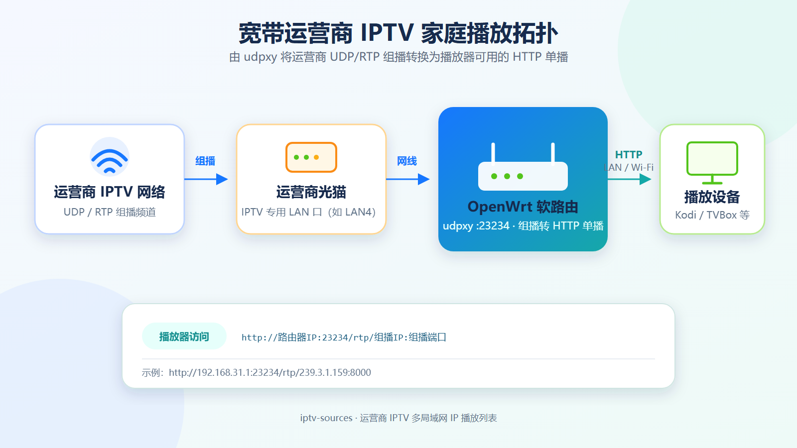

# 在 Kodi、TVBox 中看宽带运营商 IPTV

家里办宽带时，运营商通常会一并提供 IPTV 服务。但不少人并不想使用运营商的专用机顶盒，而是希望直接在电视、电脑或平板上的 Kodi、TVBox 等播放器里观看。

问题在于：**运营商 IPTV 与普通网络直播使用的传输方式并不一样。**

这次，我在 [iptv-sources](https://github.com/yunnysunny/iptv-sources) 项目中增加了宽带运营商 IPTV 的处理能力：项目会把同一份运营商频道源适配到 257 个常见局域网网关地址，并分别生成可直接订阅的 M3U 文件。你只需要找到与自己路由器 IP 匹配的版本，不必为了适配播放列表而修改整个家庭网络。

> 本次接入的频道数据来自 [qwerttvv/Beijing-IPTV](https://github.com/qwerttvv/Beijing-IPTV)，目前包含北京联通、北京移动及其组播版本。

---

## 为什么普通播放器不能直接播放运营商 IPTV

在本文所针对的家庭宽带接入环境中，运营商 IPTV 频道通常通过光猫的 IPTV 专用 LAN 口下发，使用 **UDP/RTP 组播**传输。

这些组播播放地址通常不包含额外的应用层账号鉴权。只要宽带已经开通 IPTV、光猫完成了相应配置，并将设备接入指定的 IPTV 网口，就可以收到频道数据。这个接口一般是光猫最后一个 LAN 口，例如 **LAN4**，但具体端口仍应以光猫配置和当地运营商策略为准。

而我们常用的 Kodi、TVBox 等播放器，通常更适合通过 HTTP 地址读取直播流，无法直接处理家庭网络另一侧的运营商组播。

因此，中间还需要一层协议转换：

```text
UDP/RTP 组播 → HTTP 单播
```

常见的转换工具就是 **udpxy**。

---

## 家庭网络拓扑



整体链路可以概括为：

1. 运营商通过 UDP/RTP 组播发送 IPTV 频道；
2. 光猫从 IPTV 专用 LAN 口输出频道数据；
3. OpenWrt 软路由的 WAN 口连接这个 IPTV 网口；
4. 软路由上的 udpxy 将组播转换为 HTTP 单播；
5. Kodi、TVBox 等设备通过有线网络或 Wi-Fi 访问转换后的 HTTP 地址。

---

## udpxy 是怎样工作的

假设路由器的局域网地址是：

```text
192.168.31.1
```

udpxy 的服务端口是：

```text
23234
```

某个频道原始组播地址是：

```text
rtp://239.3.1.159:8000
```

经过 udpxy 转换后，播放器访问的地址就是：

```text
http://192.168.31.1:23234/rtp/239.3.1.159:8000
```

它的通用格式为：

```text
http://路由器IP:udpxy端口/rtp/组播IP:组播端口
```

播放器看到的是普通 HTTP 地址，udpxy 则负责在后台接收运营商组播，再将数据以单播方式发送给播放器。

---

## OpenWrt 下完整配置 udpxy

下面把项目中 `openwrt-updpxy.md` 的配置完整合并进来。开始前，请先将 OpenWrt 用于接收 IPTV 的网口接到光猫的 IPTV 专用 LAN 口。

### 1. 安装 udpxy

通过 SSH 登录 OpenWrt，然后执行：

```bash
opkg update
opkg install udpxy
```

启用 udpxy，并设置监听接口、组播来源接口、服务端口和最大客户端数：

```bash
uci set udpxy.@udpxy[0].disabled='0'
uci set udpxy.@udpxy[0].respawn='1'
uci set udpxy.@udpxy[0].bind='br-lan'
uci set udpxy.@udpxy[0].source='wan'
uci set udpxy.@udpxy[0].port='23234'
uci set udpxy.@udpxy[0].max_clients='3'
uci set udpxy.@udpxy[0].status='1'
uci commit udpxy
```

这几个关键配置的含义是：

- `bind='br-lan'`：在 LAN 网桥上提供 HTTP 服务，供电视、盒子和电脑访问；
- `source='wan'`：从 WAN 接口接收运营商 IPTV 组播；
- `port='23234'`：udpxy 的 HTTP 服务端口；
- `max_clients='3'`：最多允许 3 个客户端同时使用；
- `status='1'`：开启 udpxy 状态页面。

> 如果你的 IPTV 接口不叫 `wan`，需要将 `source` 改成实际连接光猫 IPTV 网口的接口名称。双 WAN、旁路由或单线复用环境尤其需要注意这一点。

### 2. 放行 IPTV 组播流量

添加一条 OpenWrt 防火墙规则，允许来自 WAN 区域、目标地址为 IPv4 组播网段的 UDP 流量：

```bash
uci add firewall rule
uci set firewall.@rule[-1].name='Allow-IPTV-Multicast-to-udpxy'
uci set firewall.@rule[-1].src='wan'
uci set firewall.@rule[-1].family='ipv4'
uci set firewall.@rule[-1].proto='udp'
uci set firewall.@rule[-1].dest_ip='239.0.0.0/8'
uci set firewall.@rule[-1].target='ACCEPT'
uci commit firewall
/etc/init.d/firewall reload
```

这里的 `239.0.0.0/8` 是常见的 IPv4 管理域组播地址段。如果当地运营商使用其他组播范围，需要根据实际频道地址修改 `dest_ip`。如果 IPTV 接口不属于 `wan` 防火墙区域，也要同步修改规则中的 `src`。

### 3. 启动 udpxy 并设置开机自启

```bash
/etc/init.d/udpxy enable
/etc/init.d/udpxy restart
```

启动后，在同一局域网的浏览器中访问：

```text
http://路由器IP:23234/status
```

能够打开状态页面，说明 udpxy 的 HTTP 服务已经启动。接下来可以使用具体频道地址测试播放，例如：

```text
http://192.168.31.1:23234/rtp/239.3.1.159:8000
```

> 本文及项目生成的播放列表默认使用 `23234` 端口。如果你修改了 udpxy 服务端口，M3U 文件中的端口也需要同步调整。

完整的独立配置文档仍保留在项目中：[openwrt-updpxy.md](https://github.com/yunnysunny/iptv-sources/blob/main/docs/openwrt-updpxy.md)。

---

## 为什么要生成 257 份 M3U

不同品牌的路由器使用不同的默认局域网地址，例如：

```text
192.168.0.1
192.168.1.1
192.168.2.1
192.168.31.1
192.168.50.1
192.168.100.1
10.0.0.1
```

如果一份 M3U 中写死了 `192.168.1.1`，而你的路由器实际是 `192.168.31.1`，频道自然无法播放。

当然，可以修改路由器的局域网 IP 来迎合播放列表，但这样做很不划算：家里的 DHCP、固定 IP、NAS、智能家居和端口映射都可能受到影响。

更合理的方式是：**播放列表适配家庭网络，而不是家庭网络适配播放列表。**

因此，iptv-sources 现在会为每一份运营商 IPTV 源生成 257 个局域网 IP 版本：

```text
192.168.0.1
192.168.1.1
192.168.2.1
...
192.168.255.1
10.0.0.1
```

也就是：

- `192.168.[0-255].1`：共 256 个地址；
- `10.0.0.1`：1 个地址；
- 合计：**257 个常见局域网网关地址**。

项目会将每个版本分别输出为 M3U、TXT 和频道列表。例如，路由器地址为 `192.168.31.1` 时，只需选择文件名中带有 `192_168_31` 的版本即可。

这些文件统一放在 `bj_iptv/` 目录下，避免大量运营商 IPTV 文件堆在站点根目录。

---

## 如何使用

### 第一步：确认 IPTV 网口

确认宽带已经开通 IPTV，并找到光猫上用于 IPTV 的 LAN 口。它通常是 LAN4，但不同地区、运营商和光猫型号可能不同。

### 第二步：连接 OpenWrt 软路由

将软路由用于接收 IPTV 的网口连接到光猫 IPTV 专用口，并确认 OpenWrt 能从该接口收到组播流量。

### 第三步：安装并启动 udpxy

按照上文的完整 OpenWrt 配置安装 udpxy，设置监听接口和组播来源接口，添加防火墙规则，然后启动服务。

配置完成后，可以访问下面的地址检查服务状态：

```text
http://路由器IP:23234/status
```

### 第四步：选择匹配路由器 IP 的 M3U

查看路由器的 LAN 地址，并在项目生成的“局域网 IP 列表”中选择对应版本。

例如：

```text
路由器 IP：192.168.31.1
选择版本：文件名包含 192_168_31 的 M3U
```

### 第五步：导入播放器

将 M3U 地址添加到 Kodi、TVBox 或其他支持网络播放列表的播放器中，即可尝试播放。

---

## 使用前需要注意

### 1. 并非所有地区都使用相同配置

运营商 IPTV 的组播地址、VLAN、光猫端口和接入策略可能因地区而异。本文介绍的是通用处理思路，当前项目接入的是北京联通、北京移动频道源。

### 2. “没有额外鉴权”不等于任意网络都能观看

频道流通常仍受运营商接入网络、光猫配置和 IPTV VLAN 限制。离开对应宽带环境，或者没有开通 IPTV 服务，公开的组播地址通常也无法直接使用。

### 3. 注意 udpxy 的并发限制

udpxy 可以限制最大客户端数。多台设备同时播放，或者频繁切换频道时，需要根据软路由性能适当调整 `max_clients`。

### 4. Wi-Fi 质量仍然重要

组播虽然已经转换成 HTTP 单播，但高清频道仍会持续占用局域网带宽。建议电视盒子优先使用网线；使用 Wi-Fi 时，尽量选择 5 GHz 或信号质量较好的网络。

---

## 后续计划

目前项目覆盖了下面这些常见局域网网关：

```text
192.168.[0-255].1
10.0.0.1
```

如果你的路由器使用更特殊的地址，例如其他 `10.x.x.1` 或 `172.16.x.x` 网段，可以在项目中提交 Issue 或告诉我，我会根据实际使用情况继续补充。

项目地址：

**https://github.com/yunnysunny/iptv-sources**

如果你也在折腾家庭 IPTV、OpenWrt、udpxy 或 TVBox，欢迎分享你的运营商、地区、光猫型号和网络配置，让这套适配覆盖更多家庭网络环境。
